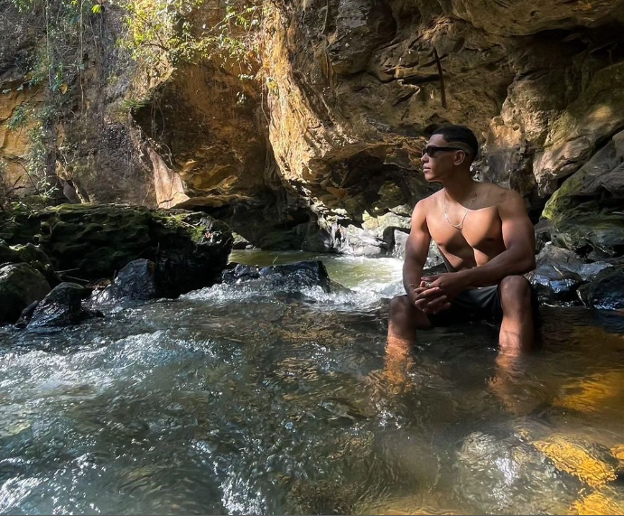

<!-- Adicione Badges das tecnologias que você usou aqui -->
<!-- Você pode encontrar badges aqui: https://github.com/Ileriayo/markdown-badges?tab=readme-ov-file#markdown-badges -->

**Este projeto foi desenvolvido como atividade final do curso de capacitação em Python da Cyber Edux, realizado de setembro de 2023 até março de 2024. Para mais informações, consulte o [enunciado](ENUNCIADO.md).**

# BookControl

<!-- Substitua a seguinte imagem por uma logo do seu projeto -->

<!-- Substitua o seguinte parágrafo por um resumo do seu projeto: -->
O sistema de controle de biblioteca escolar irá oferecer funcionalidades como o cadastro detalhado de livros, possibilitando o controle de empréstimos, reservas e devoluções. Os usuários, sejam alunos ou funcionários, podem facilmente interagir com o sistema, realizando consultas ao catálogo, efetuando empréstimos e monitorando o status de reservas. Sendo assim, contribuindo para uma gestão eficaz e organizada do ambiente bibliotecário na instituição educacional.

## Documentação

* [Documentação (para desenvolvedores)](DOCUMENTACAO.md)
* [Manual (para usuários)](MANUAL.md)

## Sobre o autor

<!-- Coloque seu nome, uma foto sua e uma pequena bio sobre você na seguinte tabela: -->
|  |  |
|:-------------:|:------------------------------------------------------------:|
|    **Anthony Famar** | Nasci em Cuiabá em 22 de junho de 2000. Atualmente, sou estudante de Ciência da Computação e faço estágio como desenvolvedor. Meus dias são preenchidos com estudos para me tornar um programador e tenho como hobby a emoção de andar de moto, sair com amigos e me dedicar à academia. Essa mistura de paixões é o que torna minha jornada única e envolvente. |
